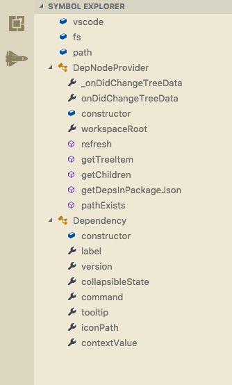
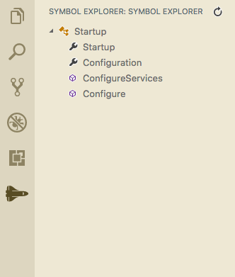

# Symbol Explorer

A simple vscode extension to provide and explorer view of the symbols in the active document.

## Features

- Views for Explorer, Debugger, and now a separate of it's own!
- Lists all symbols in the active document
- Sort symbols alphabetically
- Symbols are grouped by container (i.e. methods within a class are grouped under that class)
- Symbols update automatically when your document is saved
- Refresh the list

### Explorer View

### Activity Bar

## Configuration

- `vscode-symbolexplorer.showExplorer`: Show or hide Symbol Explorer in Explorer View (defaults to true, requires window reload)
- `vscode-symbolexplorer.showExplorerDebug`: Show or hide the Symbol Explorer in Debug View (defaults to false, requires window reload)
- `vscode-symbolexplorer.autoStart`: Whether to auto-check for symbols on start up
- `vscode-symbolexplorer.autoStartDelay`: Delay auto-start to allow language server to start

## Requirements

The only requirement is having a document open that supports symbols.

## Known Issues

- Code complexity scoring has only been tested on C# and may not yet work properly in other languages
- Depending on what extension is providing the symbols for your file, you may have to hit the refresh button after the extension has finished loading (for instance, with the C# extension, once omnisharp has finished loading your project)

## Contributions

- Icon provided by [Font Awesome](https://fontawesome.com/icons/space-shuttle?style=solid) ([License](https://fontawesome.com/license))

## Release Notes

### 0.0.10

- Adjust telemetry reporter events a bit

### 0.0.9

- Added auto start settings
- Added telemetry reporter (respects global vscode telemetry setting)

### 0.0.8

- Added buttons to sort symbols alphabetically
- Experimental support for showing code complexity, in the tooltip of the symbol
- Fix for [#8](https://github.com/sunmorgus/vscode-symbolexplorer/issues/8)

### 0.0.7

- Symbols are grouped by container
- Added Activity Bar view
- Added config values to Explorer view and Debug view

### 0.0.6

- Fix for a bad merge

### 0.0.5

- Added Symbol Explorer to the Debug View [#5](https://github.com/sunmorgus/vscode-symbolexplorer/issues/5)

### 0.0.3

- Fix for [#2](https://github.com/sunmorgus/vscode-symbolexplorer/issues/2)
- Added icon
- Changed Display Name to 'Symbol Explorer'

### 0.0.2

- Fix for [#1](https://github.com/sunmorgus/vscode-symbolexplorer/issues/1)

### 0.0.1

- Initial release of `vscode-symbolexplorer`

## Todos:

1. Ability to reorganize you code with drag and drop
1. Code complexity scoring for individual symbols
1. Ability to group sybmols with regions (if the current document supports regions)
