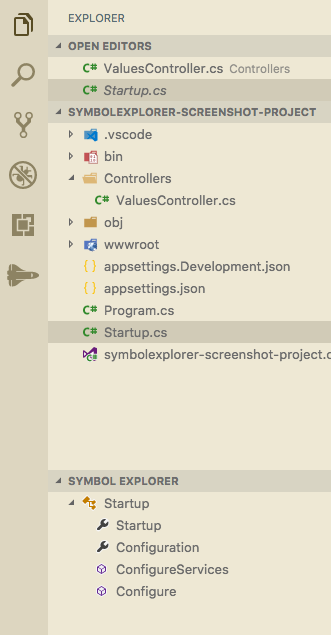

# Symbol Explorer

A simple vscode extension to provide and explorer view of the symbols in the active document.

## Features

1. Lists all symbols in the active document
1. Symbols update automatically when your document is saved
1. Refresh the list

## Requirements

The only requirement is having a document open that supports symbols.

## Known Issues

Depending on what extension is providing the symbols for your file, you may have to hit the refresh button after the extension has finished loading (for instance, with the C# extension, once omnisharp has finished loading your project)

## Contributions

1. Icon provided by [Font Awesome](https://fontawesome.com/icons/space-shuttle?style=solid) ([License](https://fontawesome.com/license))

## Release Notes

### 0.0.3

- Fix for [#2](https://github.com/sunmorgus/vscode-symbolexplorer/issues/2)
- Added icon
- Changed Display Name to 'Symbol Explorer'

### 0.0.2

- Fix for [#1](https://github.com/sunmorgus/vscode-symbolexplorer/issues/1)

### 0.0.1

- Initial release of `vscode-symbolexplorer`

## Todos:

1. Ability to reorganize you code with drag and drop
1. Code complexity scoring for individual symbols
1. Ability to group sybmols with regions (if the current document supports regions)
